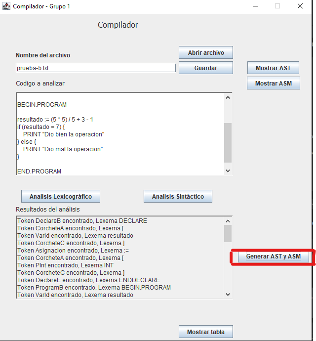
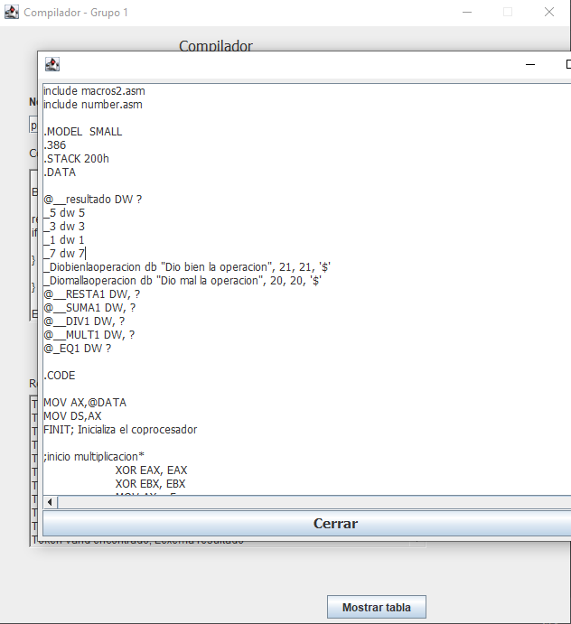
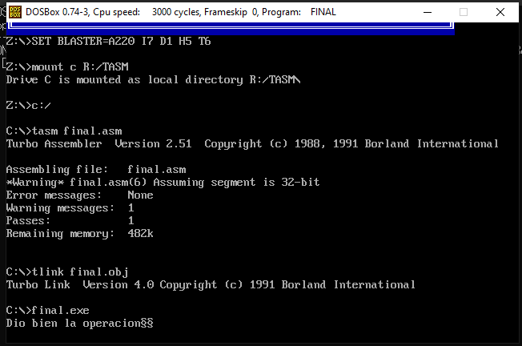

# ASM

A continuación se mostrarán ejemplos de como se corrió el programa con diferentes casos.

1. Para los siguientes se requirió instalar [DOSBox](https://www.dosbox.com/) y [TASM](https://drive.google.com/file/d/0BxFfQqBvZCltMHdNbFFCZVJkUlE/view).
Se descomprimió el zip del enlace de TASM, y en la configuración de DOSBox se agregaron las siguientes líneas.

        mount c R:\TASM
        c:\
        tasm final.asm
        tlink final.obj
        final.exe        

Donde `R:\TASM` es la ruta donde se descomprimieron los ficheros que contiene el zip.

Para entrar en el archivo de configuración se puede ir a la capeta donde se instaló DOSBox y ejecutar `DOSBox 0.74-3 Options.bat`.

2. Se copiaron al directorio donde están los aschivos de TASM (en el caso de este ejemplo fue `R:\TASM`) los macros .asm que se nos pasaron por el aula virtual: `number.asm`, `numbers.asm`, `macros.asm` y `mnacros2.asm`

3. Luego, al abrir DOSBox, ejecutamos los comandos de TASM para compilar el programa en assembler generado desde nuestro compilador.

## Pruebas

1) Abrimos un archivo con el siguiente código:

        DECLARE
            [resultado] := [INT]
        ENDDECLARE
        
        BEGIN.PROGRAM
        
        resultado := (5 * 5) / 5 + 3 - 1
        if (resultado = 7) {
            PRINT "Dio bien la operacion"
        } else {
            PRINT "Dio mal la operacion"
        }
        
        END.PROGRAM

2) Clickeamos el botón `Generar AST y ASM`.

3) Clickeamos el botón `Mostrar ASM`.

Acá se puede ver el código assembler generado. También, este programa se guarda en un archivo llamado `final.asm`.

4) Copiamos el archivo generado a `R:\TASM` y abrimos DOSBox.

### Segunda prueba

1) Abrimos un archivo con el siguiente código:

         DECLARE
            [suma, contador, d1] := [FLOAT, INT, FLOAT]
            [actual, contar, palabra] := [FLOAT, FLOAT, STRING]
            [var] := [INT]
         ENDDECLARE
         
         BEGIN.PROGRAM
         
            PRINT  "Prueba.txt AnalizadorLexico"
            contador := 0
            suma := 76.5
            contar := 18.22
            
            while (contador <= 9) {
               contador := contador + 1
               actual := (contador * (contar + 4.67))
               suma := suma + actual
            }
            PRINT  "La variable suma"
            
            
            If ((actual > 2) and (actual <> 0)){
               PRINT  "actualesmayorque2ydistintode"
               palabra := "es mayor"
            }
            Else{
               PRINT "no es mayor que 2"
               palabra := "es mayor"
            }
            
            If (INLIST(contador, [2 ; 12 ; 24 ; 48])){
               d1 := 3.14
            }
         
         
         END.PROGRAM

2) Generamos el assembler y lo copiamos a `R:\TASM`.

3) Copiamos el archivo generado a `R:\TASM` y abrimos DOSBox.

