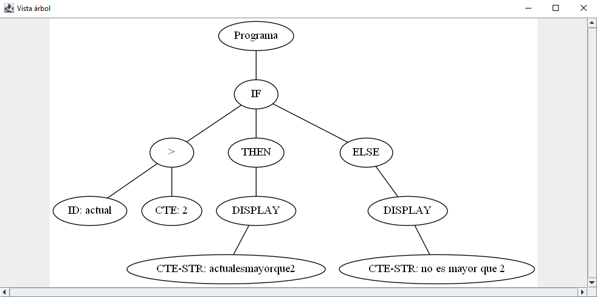
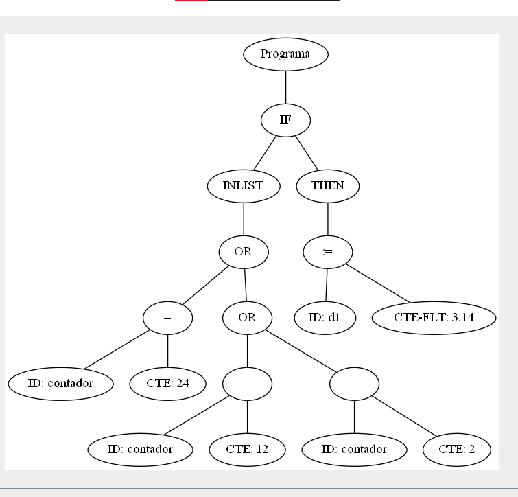

# Demo AST

Se requiere tener instalado un JDE y [Graphviz](https://graphviz.org/download).

1) Con el siguiente comando desde este directorio:
        
        java -jar Compiladores.jar

Debería poder ver la siguiente ventana:

2) Con el botón "abrir archivo" se abrirá una ventana para poder seleccionar el archivo a compilar. Si se selecciona el archivo

        prueba_display.txt

Que contiene las instrucciones:
        
        PRINT  "Prueba_b.txt"
        
        PRINT  "La variable suma"

Luego, se presiona el botón "Generar AST" y, finalmente, se presiona "Mostrar AST", se debería poder ver la siguiente ventana:

3) Al procesar el archivo

        prueba_asignacion.txt

Que contiene las instrucciones:

        contador := 0
        suma := 76.5
        contar := 18.22

Se obtiene el AST:

    
4) Al procesar el archivo

        prueba_if.txt

Que contiene las instrucciones:

        If (contar = 1){
            d1 := 3.14
        }

Se obtiene el AST:

5) Con:

        prueba_if_else.txt

Que contiene las instrucciones:

        If ((actual > 2)){
            PRINT  "actualesmayorque2"
        }
        Else {
            PRINT "no es mayor que 2"
        }

Se obtiene el AST:

6) Con

        prueba_inlist.txt

Que contiene las instrucciones:

        If (INLIST(contador, [2 ; 12 ; 24])){
            d1 := 3.14
        }

Se obtiene el AST:

